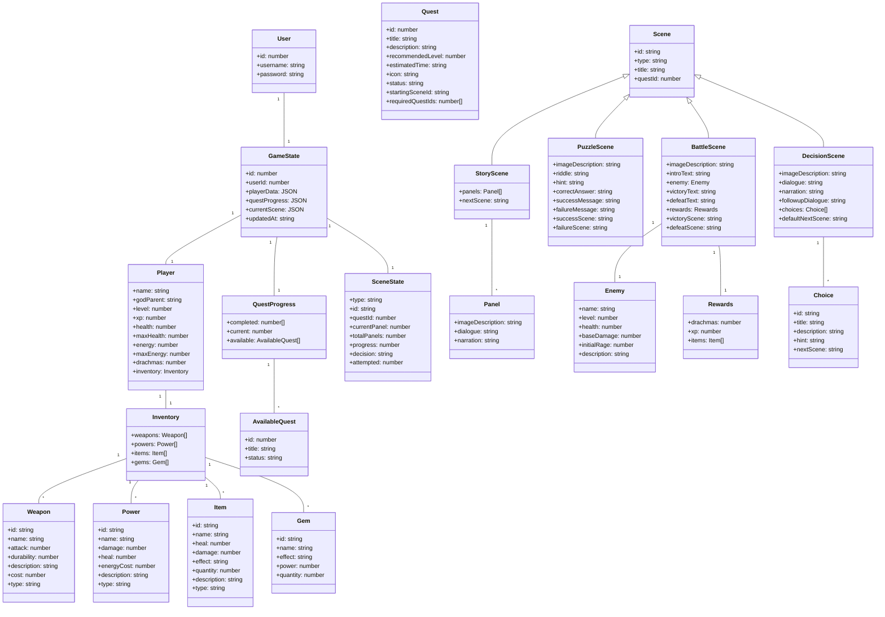
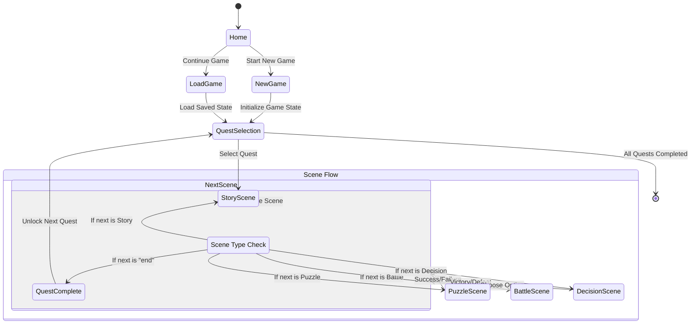
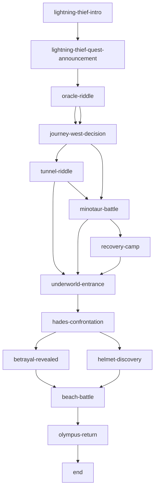

# QuestNexus Data Models and Game Flow

## Data Models Diagram

## Game Flow Diagram

## Game Mechanics

### Player Progression

1. **Experience and Leveling**
   - Players gain XP from completing battles and quests
   - When XP threshold is reached (level * 100), player levels up
   - Leveling up increases max health by 10 and max energy by 5
   - Health and energy are fully restored on level up

2. **Inventory Management**
   - Players can collect and use various items:
     - Weapons: Used in battle to deal damage
     - Powers: Special abilities that cost energy
     - Items: Consumables for healing or dealing damage
     - Gems: Special collectibles with unique effects

3. **Combat System**
   - Turn-based combat with the following actions:
     - Attack with weapons (costs energy)
     - Use powers (costs energy)
     - Use items (no energy cost)
     - Dodge (recovers energy)
   - Enemy has health and rage meters
   - Enemy rage increases with each turn, making attacks stronger

### Quest Structure

1. **Quest Progression**
   - Quests are unlocked sequentially
   - Each quest has a recommended player level
   - Completing a quest unlocks the next quest in the sequence

2. **Scene Types**
   - **Story Scenes**: Narrative progression with dialogue and narration
   - **Puzzle Scenes**: Riddles that test the player's problem-solving skills
   - **Battle Scenes**: Combat encounters with enemies
   - **Decision Scenes**: Choices that affect the story path

3. **Branching Paths**
   - Decisions and puzzle/battle outcomes can lead to different scenes
   - Multiple paths through each quest
   - Success/failure states affect rewards and story progression

## Data Persistence

1. **Local Storage**
   - Game state is saved to browser localStorage after each significant action
   - Includes player stats, inventory, quest progress, and current scene

2. **Server Storage**
   - Game state can be saved to the server database (currently commented out in code)
   - Uses PostgreSQL with Drizzle ORM
   - Enables potential for cross-device play and online features
  

